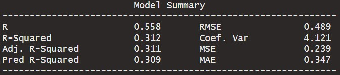

```{r setup, include=FALSE, echo=FALSE}
options(htmltools.dir.version = FALSE)
knitr::opts_chunk$set(
  fig.retina=2,
  #out.width = "75%",
  #out.height = "50%",
  htmltools.preserve.raw = FALSE,      # needed for windows
  scipen=100,                          # suppresses scientific notation
  getSymbols.warning4.0 = FALSE,       # suppresses getSymbols warnings
  cache = FALSE,
  echo = TRUE,
  hiline = TRUE,
  message = FALSE, 
  warning = FALSE
)


# install helper package (pacman)
# pacman loads and installs other packages, if needed
if (!require("pacman")) install.packages("pacman", repos = "http://lib.stat.cmu.edu/R/CRAN/")

# install and load required packages
# pacman should be first package in parentheses and then list others
pacman::p_load(pacman, tidyverse, gridExtra, magrittr, tools)

# verify packages (comment out in finished documents)
p_loaded()


```

```{r xaringan-themer, include=FALSE, warning=FALSE}
library(xaringanthemer)

palette <- c(
  SU_Orange1        = "#F76900",
  SU_Orange2        = "#FF8E00",
  SU_Red_Orange     = "#FF431B",
  SU_Blue1          = "#000E54",
  SU_Blue2          = "#203299",
  SU_Light_Blue     = "#2B72D7",
  SU_White          = "#FFFFFF",
  SU_Light_Gray     = "#ADB3B8",
  SU_Medium_Gray    = "#707780",
  SU_Black          = "#000000", 
  
  steel_blue        = "#4682B4",
  corn_flower_blue  = "#6495ED",
  deep_sky_blue     = "#00BFFF",
  dark_magenta      = "#8B008B",
  medium_orchid     = "#BA55D3",
  lime_green        = "#32CD32",
  light_sea_green   = "#20B2AA",
  chartreuse        = "#7FFF00",
  orange_red        = "#FF4500",
  white_smoke       = "#F5F5F5",
  dark_cyan         = "#008B8B",
  light_steel_blue  = "#B0C4DE",
  indigo            = "#4B0082",
  ivory             = "#FFFFF0",
  light_slate_grey  = "#778899",
  linen             = "#FAF0E6",
  steel_blue        = "#4682B4",
  blue_violet       = "#8A2BE2",
  dodger_blue       = "#1E90FF",
  light_blue        = "#ADD8E6",
  azure             = "#F0FFFF",
  lavender          = "#E6E6FA")

primary_color = "#4682B4"                # steel_blue
secondary_color = "#778899"              # light_slate_grey
white_color = "#FFFFF0"                  # ivory
black_color = "#000080"                  # navy

style_duo_accent(
  primary_color = primary_color,
  secondary_color = secondary_color,
  white_color = white_color,
  black_color = black_color,
  text_color = black_color,
  header_color = primary_color,
  background_color = white_color,
  code_inline_background_color = "#E6E6FA", # lavender
  link_color = "#1E90FF",                   # dodger_blue
  code_inline_color = "#4B0082",            # indigo
  text_bold_color = "#8B008B",              # dark_magenta
  header_font_google = google_font("Open Sans"),
  text_font_google = google_font("Open Sans"),
  code_font_google = google_font("Source Code Pro"),
  colors = palette
)


```

```{r xaringan-panelset, echo=FALSE}
xaringanExtra::use_panelset()
```

```{r xaringan-tile-view, echo=FALSE}
xaringanExtra::use_tile_view()
```

```{r xaringan-fit-screen, echo=FALSE}
xaringanExtra::use_fit_screen()
```

```{r xaringan-tachyons, echo=FALSE}
xaringanExtra::use_tachyons()
```

```{r xaringan-animate-css, echo=FALSE}
xaringanExtra::use_animate_css()
```

```{r xaringan-animate-all, echo=FALSE}
#xaringanExtra::use_animate_all("slide_up")
```

background-image: url("docs_files/images/sloth_faded.png")
background-size: cover

class: bottom, right

## BUA 345 - Lecture 12

### Categorical Regression - Parellel Lines Model

<br>


#### Penelope Pooler Eisenbies

#### `r Sys.Date()`

[Wikipedia Sloth Page](https://en.wikipedia.org/wiki/Sloth)

---

### Getting Started with Markdown

- Download Zipped R project 

- Open Zipped folder and copy internal folder (R Project) to a BUA 345 folder on your computer NOT IN DOWLOADS

- Click on .Rproj file to open project

- Click on `code_data_output` file to open it.

- Click on `BUA_345_Lecture_12.Rmd` to open it.

- Run Setup Chunk

---

### Setup

* The setup chunk shows the packages needed for this demo.   

* R will install specified packages if needed (only required once after R is installed)  

* R will load specified packaged (required every time you start a new R session)  

* The first time you run this code, R will install these packages which will be slow.  

* **If you get warnings, that's okay.**  

* If you get **error messages**, I (or TA), can help you.

---

### Setup Chunk for Lecture 12

```{r setup for Lecture 12, include = T}


# this line specifies options for default options for all R Chunks
knitr::opts_chunk$set(echo=T, highlight=T)

# suppress scientific notation
options(scipen=100)

# install helper package that loads and installs other packages, if needed
if (!require("pacman")) install.packages("pacman", repos = "http://lib.stat.cmu.edu/R/CRAN/")

# install and load required packages
pacman::p_load(pacman,tidyverse, magrittr, olsrr, gridExtra, ggiraphExtra)

# verify packages
p_loaded()

```

**NOTES:

- ** Don't worry about `xaringanthemer` package (required for my slides but not for your code).

- New Package: `ggiraphExtra`

---

### Review Question - Import data

-   Recall The Tennessee Real Estate data:

```{r import data and create transformed variable}

# import and examine data
tn_houses <- read_csv("TN_houses.csv", show_col_types = F) |>
  glimpse(width=75)

```

---

### Review Question -  Natural Log transformation

-   We will build an MLR model was using the natural log of Price (ln_Price)
-   This transformation is needed because Price is **RIGHT-SKEWED**.
-   Review of how to create this transformation

```{r ln transformation of Price}

# create new variable in tn_houses dataset
# ln_price = the natural log of price
tn_houses <- tn_houses |>
  mutate(ln_price = log(Price)) |>
  glimpse( width=75)

```

---

### Review Question - Examination Variable Distrbutions

- Histogram of `Price` (`hist_price`), shows distribution of raw data is right-skewed with high outliers.

- Histogram of `ln_price` (`hist_ln_price`) shows distribution of ln transformed data is symmetric and normally distributed.

```{r creating  and formatting histograms of Price and ln_price}

# histogram of original price data
hist_Price <- tn_houses |> 
  ggplot() +  
  geom_histogram(aes(x=Price), color="darkblue", fill="lightblue") + 
  labs(x="Selling Price", y="Frequency") +  
  theme_classic() + 
  theme(axis.title = element_text(size=18),
        axis.text = element_text(size=15),
        plot.background = element_rect(colour = "darkgrey", fill=NA, size=2))

# histogram of ln_price
hist_ln_price <- tn_houses |> 
  ggplot() +  
  geom_histogram(aes(x=ln_price), color="darkgreen", fill="lightgreen") + 
  labs(x="Natural Log of Selling Price", y="Frequency") +  
  theme_classic()+ 
  theme(axis.title = element_text(size=18),
        axis.text = element_text(size=15),
        plot.background = element_rect(colour = "darkgrey", fill=NA, size=2))

```

---

```{r display of histograms, , fig.width=14, fig.height=7, fig.align='center'}

# display of these two histograms side by side
grid.arrange(hist_Price, hist_ln_price, ncol=2)

```

---

### Review Question -  Regression model using `ln_price`

```{r regression model using ln_price, results='hide'}

# saves model and prints it to screen because it is enclosed in parentheses
(tn_houses_mlr <- ols_regress(ln_price ~ Bedrooms + Bathrooms, data=tn_houses))

```

#### Abridged Output

```{r abridged mlr output, echo=F}




```

---

### Lecture 12 In-class Exercises - Back-transforming Model Estimates

#### **Question 1 (L12) - Session ID: bua345s23**

**Based on the model output, What is the estimated price of a house with 4 bedrooms and 3 bathrooms (rounded to closest $1000)?**

```{r review question incomplete R code, eval=F}

# incomplete model equation
# fill in intercept and values from question
(y_est <- ___ + 0.056*4 + 0.375*3)

# back-transform y_est using exp function
(est_dollars <- exp(y_est))

# round to 1000
round(est_dollars,-3)

```

NOTE: All 3 steps above could be done with one line but it is helpful to break it down when learning.

---

### Review of Regression Terms

#### R<sup>2</sup> and Adjusted R<sup>2</sup>:

- **R** is the correlation coefficient, R<sub>XY</sub>

- **R<sup>2</sup>** is (R<sub>XY</sub>)<sup>2</sup>

- **R<sup>2</sup>** is also called coefficient of determination

- **Meaning of R<sup>2</sup> in SLR:** Proportion of variability in y explained by X

- **Adjusted R<sup>2</sup>** adjusts **R<sup>2</sup>** for number of explanatory (X) variables in model.

  -   Much more to come about this.
  -   Meaning of **Adjusted R<sup>2</sup>** in MLR is a little less specific but similar to **R<sup>2</sup>**

-   Other values will be covered in upcoming lectures.

---

#### Review of Parameter Estimates Output

- **`model`** column lists intercept and X variables in model

- **`Beta`** column shows the estimate of the $\beta$ coefficients for each variable in model.

- **`Std. Error`** shows variability of each estimated Beta coefficient estimate.

- **`t`** = `Beta/Std. Error`, the test statistic for each Beta coefficient estimate.

- **`Sig`** is P-value for Hypothesis test for each Beta coefficient estimate:

**Recall Hypotheses being tested:**

<center>
```{r reg hypotheses, echo=FALSE}


```

</center>
---

#### Review of Parameter Estimates Output

Recall Interpretation guidelines for P-value:

<center>

```{r pv interpretion, echo=FALSE}

knitr::include_graphics("docs_files/images/pv_decisions.png")

```

</center>

<br>

Reminder of Example Output:

```{r mlr parameter estimates, echo=F}


```

---

### Types of Data - Review (Previous Stat Course)

<center>

```{r echo=F, out.extra='style="background-color: #202020; padding:1px; display: inline-block;"'}


```

</center>

---

### Types of Data - More on Categorical Data

- Categorical variables are categories that describe data observations

  - Gender, Location, Hair Color, Eye Color, Location, etc.

- Ordinal Categories have an **OBJECTIVE** order:

  - Grades: A, B, C, D

  - College year: Freshman, Sophomore, Junior, Senior

- Nominal Categories don't have an objective order:

  - Location

  - Hair color
    
  - Gender
  
---

### Data Examples - R Star Wars Dataset

- Dataset of characters from Star Wars franchise

```{r eval=F}
?starwars # run this line to see help file documentation
```

```{r example from R starwars data}

my_starwars <- starwars           # save R starwars dataset to Global Environment
my_starwars |> glimpse(width=75)  # examine data

```

---

### Examining Data

-   A good way to examine categorical data variables is to examine how many observations are in each category.
-   For example, we can examine the Star Wars character data by species and gender
-   Too many species...

```{r summary of starwars species}

# summarizing starwars character data by species and gender
my_starwars |> select(species, gender) |> table()

```

---

### Lecture 12 In-class Exercises 

#### **Question 2 (L12) - Session ID: bua345s23**

**Is species a nominal or ordinal variable?**

<center>

```{r echo=F, out.extra='style="background-color: #202020; padding:1px; display: inline-block;"'}


```

</center>

---

### Star wars Example  - Examining categorical Data

- Since `Human` is the most common species, we can filter the data to look at those characters only.
-   Then we can examine prevalence of each gender and eye color among human characters.

```{r summary of gender and eye color}

my_starwars |> filter(species=="Human") |> # filter to humans only
  select(gender, eye_color) |>             # examine genders and eye colors
  table()

```

---

### Lecture 12 In-class Exercises

#### **Question 3 (L12) - Session ID: bua345s23**

- **Which R command is used to summarize the number of observations in each gender x eye_color combination?**

NOTE: This useful command will also be used in HW 6.

---

### Data Examples - GT cars dataset

- Deluxe automobiles from the 2014-2017 period

```{r eval=F}
?gt::gtcars # run this line to see help file documentation
```

```{r import gtcars dats}

gt_cars <- read_csv("gt_cars.csv", show_col_types = F) |> # import data
  glimpse(width=75) 

```

---

### GT Cars Example  - Examining categorical Data

```{r examine categories within gt data}

gt_cars |> select(bdy_style, year) |> table()

```
<br>

### Lecture 12 In-class Exercises

#### **Question 4 (L12) - Session ID: bua345s23**

**Which variable in gt_cars, body style (`bdy_style`) or `year` **could** be treated as ordinal?**

---

### Categorical Regression

- Categorical variables can (and should) be used in linear regression models

- If these categories exist in the data and we ignore them, then we assume that the linear relationship is the SAME FOR all categories.

- The following two examples illustrate the importance of adding a categorical variable to a regression model when needed.

---

### Data Example - Celebrity Salaries Data

-   Many (not all) celebrities see a decrease in their annual income as they age.

-   There is a negative relationship between wages and ages.

-   Is this relationship the same for males a females?

```{r import and examine celebrity data}

# import celebrity data
celeb <- read_csv("celeb.csv", show_col_types = F) |>
  glimpse(width=75) 

```

---

### Celebrity Salaries Data - Examining categories and Correlations

```{r}
celeb |> select(Gender) |> table()  # examine counts for each category

celeb |> select(Earnings, Age) |> cor() |> round(2) # examine correlation between earnings and age

```


---

### Celebrity Salaries Data - Examining Model Options

.pull-left[

#### Model Option 1: SLR

- This model assumes no difference between males and females.
- In this case we use Base R command for regression, `lm`.
- Model created with `lm` can be used to create an interactive plot.


```{r celeb slr model}

# slr model created using lm
celeb_slr <- lm(Earnings ~ Age, data=celeb)

# create and save interactive plot
int_clb_slr <- ggPredict(celeb_slr, interactive=T)

```

The interactive plot shows the model equation when the cursor is on the line.

]

.pull-right[

```{r echo=F}
int_clb_slr 
```


]


---

### Celebrity Salaries Data - Examining Model Options

.pull-left[

#### Model Option 2: Categorical Regression Model

-   The SLR mode is okay, but we can probably do better.
-   It is logical to suspect there is a difference between males and females in terms of earnings
-   We add `Gender` to the model to test this:


```{r celeb mlr model}

# mlr model created using lm
celeb_cat_lm <- lm(Earnings ~ Age + Gender, data=celeb)

# create and save interactive plot
int_clb_mlr <- ggPredict(celeb_cat_lm, interactive=T)

```

The interactive plot shows each model equation when the cursor is on the line.

]

.pull-right[

```{r echo=F}
int_clb_mlr
```


]

---

### Celebrity Salaries Data - MLR Model Output

- We can see the model equation (poorly formatted) for each gender, in the plot.
- We can also get these equations from the model output, but it requires a little work.
- Examine the model output:

```{r celeb cat mlr formal output, results='hide'}

# formatted regression output
# model is saved and printed to screen
(celeb_cat_ols<- ols_regress(Earnings ~ Age + Gender, data=celeb))

```

#### Abridged Output

```{r abridged mlr cat output, echo=F}


knitr::include_graphics("docs_files/images/celeb_cat_mlr2.jpg")

```


---


### Getting Model Equations from Regression Output

- By default R chooses baseline categories alphabetically

  - `Female` is before `Male` so `Female` is the baseline

  - Female SLR Model: `Est. Earnings = 134.112 - 2.37 * Age`

  - Male SLR Model:

    - `Est. Earnings = 134.112 - 2.37 * Age + 15.383`

    - `Est. Earnings = 134.112 + 15.383 - 2.37*Age`

    - `Est. Earnings = 149.505 - 2.37 * Age`

- The difference between the intercepts for Females and Males is shown in the model output.

  - Difference in intercepts is labeled with name of categorical variable and category

  - Difference (Increase) for Males is labeled **`GenderMale`** and equals **`15.383`**

---

### Lecture 12 In-class Exercises

#### **Question 5 (L12) - Session ID: bua345s23**

**Based on our categorical regression model, is the difference between male and female earnings (approx. 15 $M), statistically significant?**

HINT:  Look at the p-value for the **`GenderMale`** term in the model to answer this question.

---

### Data Example - House Remodeling Data

-   What is the effect of remodeling on house selling price?

```{r import and examine house remodel data}

# import house remodeling data
house_remodel <- read_csv("house_remodel.csv", show_col_types = F) |>
  glimpse(width=75) 

```

---

### House Remodeling Data - Examine Categories and Correlations

-   What is the effect of remodeling on house selling price?

```{r  examine categories and correlations} 

# examine number of obs in each category
house_remodel |> select(Remodeled) |> table() 

# correlation between price and square feet
house_remodel |> select(Price, Square_Feet) |> cor() |> round(2)

```


---

### House Remodeling Data - Examining Model Options

.pull-left[

#### Model Option 1: SLR

- SLR model assumes no difference due to remodeling
- Again, we use Base R command for regression, `lm`
- Model created with `lm` can be used to create an interactive plot.


```{r house remodel slr model}

# slr model created using lm
rem_slr <- lm(Price ~ Square_Feet, data=house_remodel)

# create and save interactive plot
int_rem_slr <- ggPredict(rem_slr, interactive=T)

```

The interactive plot shows the model equation when the cursor is on the line.

]

.pull-right[

```{r echo=F}
int_rem_slr

```


]


---

### House Remodeling Data - Examining Model Options

.pull-left[

#### Model Option 2: Categorical Regression Model

- SLR mode is okay, but there is likely to be a difference between `Remodeled` and un-`Remodeled` houses.
- To test for that difference we add the categorical variable `Remodeled` to the model:

```{r house remodel mlr model}

# mlr model created using lm
rem_cat_lm <- lm(Price ~ Square_Feet + Remodeled, data=house_remodel)

# create and save interactive plot
int_rem_mlr <- ggPredict(rem_cat_lm, interactive=T)

```

The interactive plot shows each model equation when the cursor is on the line.

]

.pull-right[

```{r echo=F}

int_rem_mlr

```


]

---

### House Remodel dataa - MLR Model Output

- We can see the model equation (poorly formatted) for each category, in the plot.
- We can also get these equations from the model output, but it requires a little work.
- Examine the model output:

```{r house rem cat mlr formal output, results='hide'}

# formatted regression output
# model is saved and printed to screen
(house_rem_ols<- ols_regress(Price ~ Square_Feet + Remodeled, data=house_remodel))

```

#### Abridged Output

```{r abridged rem mlr cat output, echo=F}


```


---

### Getting Model Equations from Regression Output

- By default R chooses baseline categories alphabetically

  - `No` is before `Yes` so un-`Remodeled` houses are the baseline

  - un-Remodeled SLR Model: `Est. Price = 137549.093 + 137.879 * Square_Feet`

  - Remodeled SLR Model:

    - `Est. Price = 137549.093 + 137.879 * Square_Feet + 90917.216`

    - `Est. Price = 137549.093 + 90917.216 + 137.879 * Square_Feet`

    - `Est. Price = _____ + 137.879 * Square_Feet`

---

### Lecture 12 In-class Exercises

#### **Question 6 (L12) - Session ID: bua345s23**

The difference between the intercepts for `Remodeled` and un-`Remodeled` houses is shown in the model output.

- Difference in intercepts is labeled with name of categorical variable and category

- Difference (Increase) for remodeling is labeled **`RemodeledYes`** and equals **`90917.216`**

**What is the **intercept** for the prices of 'Remodeled' houses in the Categorical Regression model (Round to closest thousand ($K).**

---

#### **Question 7 (L12) - Session ID: bua345s23**

**Based on our categorical regression model, is the difference in selling price between remodeled (Remodeled = `Yes`) and un-remodeled (Remodeled = `No`) homes statistically significant?**

<br>

#### Parameter Estimates Table

```{r abridged rem mlr param est, echo=F}


```


---

background-image: url("docs_files/images/tired_panda_faded.png")
background-size: cover

.pull-left[

### **Key Points from Today**

.bg-azure.b--dark_cyan.ba.bw2.br3.shadow-5.ph2[

- Categorical Parallel Lines Model

  - Separate SLR model for each category.
  - Modeling categories simultaneously with one mode is
    -   more efficient
    -   more accurate 

-   Next Similar Model BUT each category has a different slope
 
-   HW 6 is posted (Due 3/6)
 
-   First set of data is **almost** identical to `house_remodel` data.

]

]

.pull-right[

.bg-azure.b--dark_cyan.ba.bw2.br3.shadow-5.ph3[
You may submit an 'Engagement Question' about each lecture until midnight on the day of the lecture. **A minimum of four submissions are required during the semester.**
]

]


